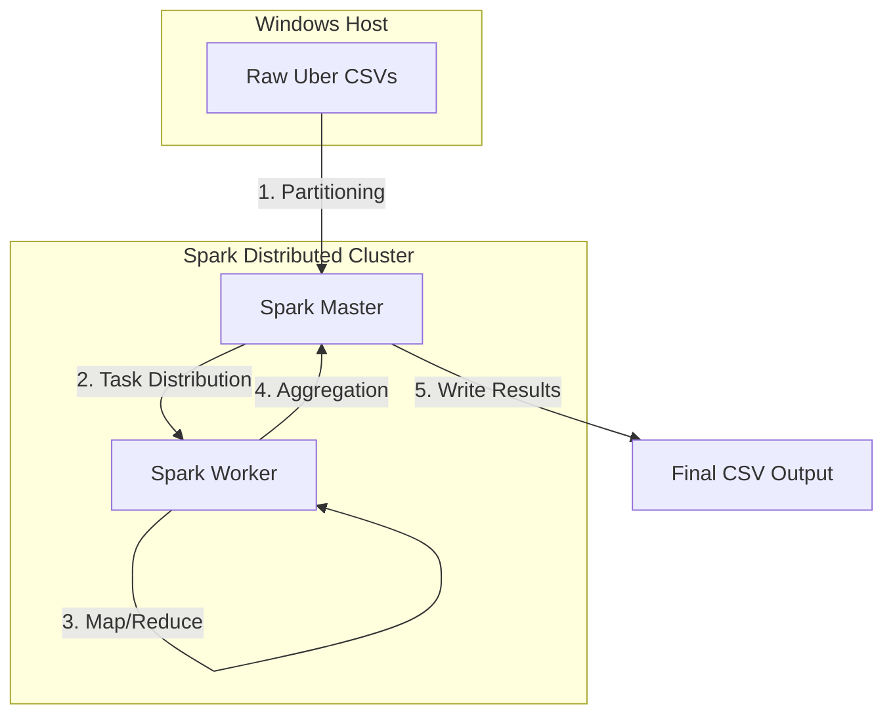

# Uber Data Analytics - Distributed Processing

## Overview

A large-scale data processing engine designed to analyze millions of Uber trip records from New York City. The project leverages a distributed cluster to identify peak demand hours and urban mobility patterns, applying Big Data principles to handle high-volume datasets.

## Core Concepts

**Distributed Computing**: Implements a Spark Master-Worker architecture to parallelize data processing across multiple nodes.

**MapReduce Paradigm**: Uses transformations and actions to filter, map, and reduce raw trip data into actionable insights.

**Scalability**: Designed to handle the 3 Vs of Big Data (Volume, Velocity, and Variety) by partitioning data for parallel execution.

**Schema Handling**: Robust data ingestion logic that manages inconsistent CSV headers across different datasets.

## Architecture



## Tech Stack

- **Language**: Python (PySpark)
- **Engine**: Apache Spark 3.5.0
- **Infrastructure**: Docker, Docker Compose
- **Dataset**: NYC Uber Trip Data

## Project Structure

- `/data`: Directory for input CSV files and processed results.
- `/src/jobs`: PySpark job implementations for distributed analysis.
- `/docker`: Configuration for the Spark Master and Spark Worker cluster environment.

## Setup and Execution

1. Clone the repository and place the Uber CSV files in the `/data` folder.
2. Start the distributed cluster:
   ```bash
   docker-compose up -d
   ```
3. Submit the analysis job to the Spark Master:
   ```bash
   docker exec -it spark-master /opt/spark/bin/spark-submit \
     --master spark://spark-master:7077 \
     /opt/spark/work-dir/jobs/uber_analyzer.py
   ```

## Academic Context

**Developed for the Large-Scale Data Programming (Programação de Dados em Escala) course.**

- Department of Computing (DC)
- Federal University of São Carlos (UFSCar)
